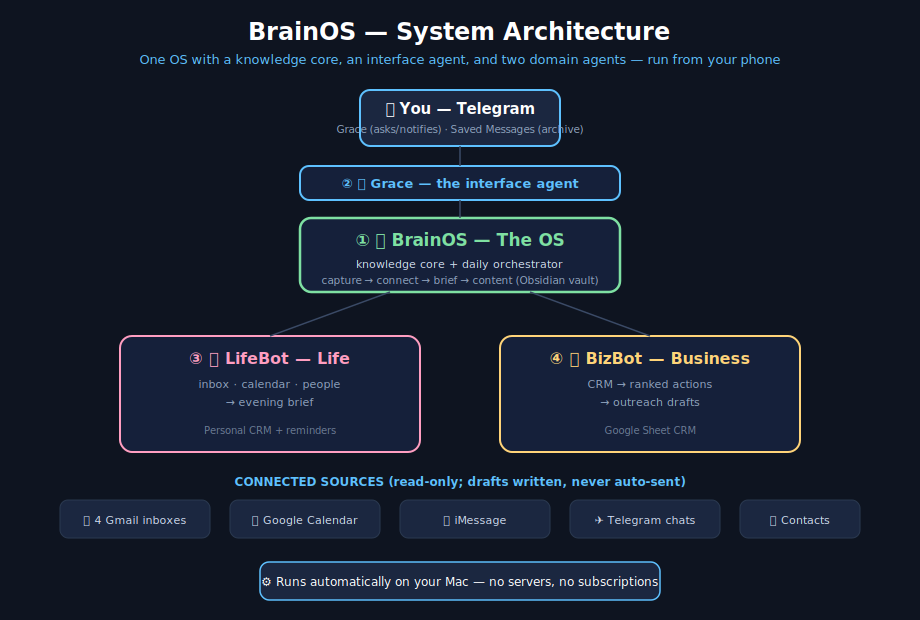
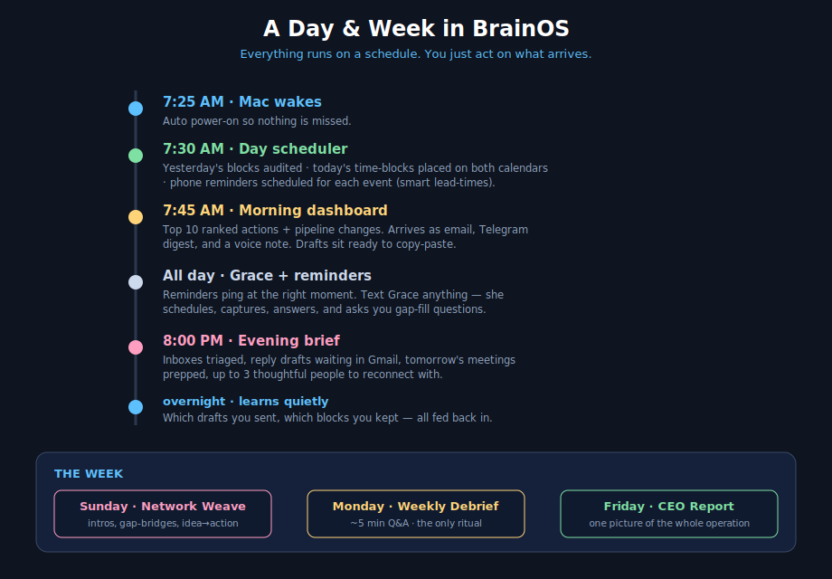
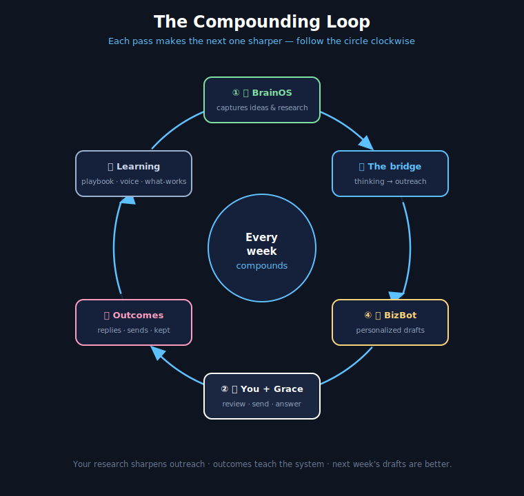

# 🧠 BrainOS

**A personal operating system: one knowledge core, one interface agent, and two domain agents — that you run from your phone.**

BrainOS watches your real inputs (email, calendar, messages, research) and turns them into ranked daily actions, ready-to-send drafts, and gentle reminders — then learns from what you actually do. No SaaS subscriptions, no servers. It runs on your own Mac and talks to you through Telegram.

> Built by Nick Marton as a personal command center. This repo is the **public overview** — the operational code and personal data live in private repos.

---

## What it is, in one picture

*BrainOS is the OS and the knowledge core. Grace is how you talk to it. LifeBot and BizBot are the two domain agents. Everything runs automatically on your Mac; you interact through Telegram.*

### The hierarchy

| # | Component | Role |
|---|---|---|
| 1 | 🧠 **BrainOS** | **The OS.** The knowledge core and daily orchestrator — captures ideas and research, finds connections, drafts content, and runs the routine that produces your daily dashboard. Lives in an Obsidian vault. |
| 2 | 📱 **Grace** | **The interface.** The Telegram agent you talk to — asks you one-tap questions, takes commands by text, sends notifications. |
| 3 | 🌙 **LifeBot** | **Life agent.** Triages your inboxes, manages your calendar, maintains a personal CRM of the people in your life, and protects your time. |
| 4 | 💼 **BizBot** | **Business agent.** Runs your outreach CRM, ranks who to contact, writes personalized drafts, tracks what gets replies. |

---

## A day in the life

*You don't "use" BrainOS so much as receive it. The schedule does the work; you act on what arrives and answer the occasional question from Grace.*

**Your entire daily involvement:** read the morning dashboard (or listen to the voice note), work the top actions by copy-pasting drafts, glance at the evening brief, and reply to Grace when she asks something. ~10 minutes of decisions; the system does the rest.

---

## How it gets smarter

*The components feed each other. Your research personalizes your outreach. Your outreach results teach the system which angles work. The people you actually reply to shape who it reminds you about. Every week compounds.*

---

## The two-minute pitch

Most "AI assistants" are a chat box you have to remember to open. BrainOS is the opposite: it's **always running, acts in the tools you already use, and only interrupts you when it needs a decision.** It drafts the email and leaves it in your Drafts folder. It schedules the reminder and it fires at the right moment. It notices you've lost touch with a friend and hands you an opener. It asks "did this deal move?" and files your answer in the right place automatically.

It's split into a core plus specialized agents because **knowledge, life, and business are different jobs** — but they share context, so a news item the core saved this morning can sharpen a sales message this afternoon.

---

## Documentation

- 📘 **[Quickstart](guide/quickstart.md)** — the daily & weekly rhythm, one page.
- 📗 **[Full Manual](guide/manual.md)** — every command, when to use it, how it works, troubleshooting.
- 🗺️ **[Diagrams](diagrams/)** — architecture, daily flow, data flow.

---

## Design principles

1. **Propose, don't auto-send.** Drafts wait for your approval. The system never speaks to anyone as you without you hitting send.
2. **One source of truth per thing.** The CRM sheet is the CRM; the vault is the knowledge; no duplicated state that can drift.
3. **Graceful degradation.** Any integration can be offline and the rest keeps working.
4. **Learn from outcomes, not opinions.** It measures what you actually sent and kept, and adapts.
5. **Privacy first.** Personal data stays on your machine and in your private accounts. This public repo contains none of it.

---

*BrainOS is a personal project. The overview here is shared to show the architecture and ideas; the operational code and all personal data are private.*
